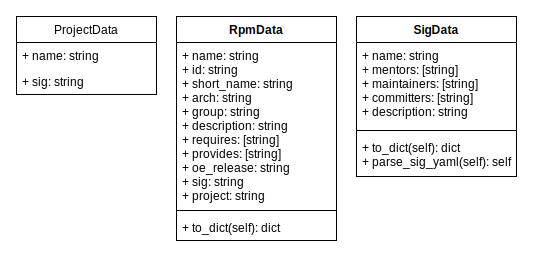

# OmniBuild Platform设计文档

## 修订记录

| 日期 | 修订版本 | 修改描述 | 作者 |
| ---- |  ----   |  ----   | ---- |
| 2022-06-14 | v0.1 | 初稿：包含整体、Omni-Imager、Omni-Insight | Zheng Zhenyu |

## 1. 项目背景

Linux发行版(Linux Distribution)是Linux操作系统的主要发布形式，它为一般用户预先集成好Linux操作系统内核以及各种系统软件、应用软件。目前业界主要的Linux发行版包括：openEuler、CentOS、Fedora、Ubuntu、SUSE等等，各个操作系统发行版在不同维度有各自的优势。通常一款操作系统发行版还会针对不同的应用场景发布不同的发行版，如Server版、Embedded版、Edge版、RaspberryPi版等等，操作系统发行版同时还需要支持多种硬件平台，如主流的x86、Arm、RISC-V等。

操作系统发行版通常使用操作系统构建工具来进行构建，目前业界主流的操作系统及软件包构建系统(工具)包括：Open Build Service(下文简称OBS)、Yocto、Koji、Pungi、Lorax等，但结合openEuler社区及各伙伴发行版厂商的实际使用情况，这些构建工具或多或少有一些问题，可以归纳如下：

| 构建系统 | 构建系统瓶颈 | 测试系统瓶颈 | 成熟度评价(满分10) |
| ---- |  ----   |  ----   | ---- |
| OBS/openQA | 1.部署和配置复杂、自动化程度低<br>2.Perl语言编写的核心服务维护难度大<br>3.Scheduler单核负载高，调度性能无法提升，阻塞二进制发布<br>4.构建机器不支持动态扩展、调度灵活性差<br>5.不支持设置保存构建失败的chroot环境<br>6.不支持设置构建历史日志保存机制<br> | 1.不支持功能测试<br>2.OBS测试与openQA测试结果无法集成 | 6.5 |
| Koji | 1.不支持依赖关系rebuild<rb>2.相同version-release的软件包<br>3.单包构建效率低，4000+软件包构建耗时5day<br>4.镜像构建时间长<br>5.镜像自定义能力差 | 1.PR级测试工程，不支持功能、兼容性、系统级别的测试，测试效率低<br>2.无规范化测试流程 | 5 |
| Pungi/Mock | 1.不支持除RPM以外的制品格式<br>2.镜像自定义能力差<br>3.构建机器不支持动态扩展，调度灵活度低| N/A | 7 |
| buildd/wanna-build | 1.单包构建时间长，相比RPM耗时2倍+<br>2.不支持镜像剪裁<br>3.软件包构建状态可视化差，无法方便查看某个架构的整体构建质量 | N/A | 8 |

用户对于操作系统定制化需求日益增长，除了镜像剪裁等基本定制化需求外，还提出了Kickstart自动化部署脚本、安装界面、Grub引导参数、文件注入、配置批量导入导出等更为丰富的定制化需求。除此之外，OSV、开发者等还对团队内构建工程之间的共享、多软件仓库软件包引入、不同镜像之间的继承关系、镜像的重复构建、镜像的长期存储等服务化问题提出了诉求。这类诉求仅依靠当前构建工具(系统)是无法实现的。

OmniBuild Platform(以下简称OBP)是由openEuler Infrastructure SIG主导的服务化操作系统构建平台，旨在为用户提供易用、高效的软件包持续构建，操作系统镜像自定义构建，自定义CICD任务等多种构建任务。OmniBuild Platform使用Kubernetes提供可扩展且支持异构环境的任务执行引擎，为用户提供云原生时代下高效的统一构建平台。

## 2. 总体设计

OBP一期重点关注ISO的定制、编辑和剪裁，为用户提供服务化的ISO定制平台，主要部件如下图所示：


- API & CLI：为用户提供CLI及API接口，便于与用户现有构建系统进行对接
- WebUI：基于Vuejs的前端应用，为用户提供方便好用的图形化使用界面
- Event Trigger：为用户提供与第三方平台对接的事件触发机制，包括Jenkins Job、Github Actions等
- Omni-Manager：OBP项目整体的管理中心，提供用户管理、鉴权、任务管理、配置管理、下载管理等内容
- Omni-Scheduler：基于LibSolv SAT solver及自研依赖解析器的分布式软件包依赖分析，并根据依赖分析结果进行任务调度
- Omni-Syncer：负责上游仓库与OBP系统中本地仓库的同步
- Omni-Repository：存储中心，负责OBP系统所产出的二进制包、软件包等构建产出的存储和下载
- Omni-Orchestrator：基于Kubernetes/Cadence/CompassCI等调度平台提供的可扩展且支持异构环境的任务执行引擎
- Omni-Imager：用于构建操作系统发行版镜像的Worker组件，支持多种镜像格式及多种ISO Installer后端
- Omni-Packager：用于构建软件包的Worker组件，支持多种软件包格式
- Omni-Insight：用于解析openEuler社区SIG组情况及各软件包归属情况，并在数据库中存储，为用户提供软件包与各SIG组的匹配关系，依赖关系等相关内容

OBP组件中各Worker均对外提供API、CLI，可作为构建工具单独部署及使用，同时提供容器化部署形态，与OBP平台整体集成，作为分布式Worker对外提供服务。

OBP典型部署图：



## 3. 各子系统详细设计

### 3.1 Omni-Imager

Omni-Imager是OBP系统中用于构建操作系统发行版的Worker程序，根据用户输入进行操作系统构发行版构建、操作系统镜像KickStart脚本提取、编辑、文件注入等相关功能。模块使用Python3.9进行开发。

#### 3.1.1 关键上下文

Omni-Imager可以单独部署，通过CLI为用户提供相应功能，同时也可以作为Worker作为OBP平台的一部分对外提供服务，作为OBP Worker对外提供服务时，与平台中其他服务的交互关系为：


| 组件 | 接口 | 场景 |
| ---- |  ----   |  ----   |
| Omni-Orchestrator | CLI | 作为OBP Worker与其他组件集成部署，以容器化形态进行部署，接受Omni-Orchestrator CLI调用，根据输入进行相应操作 |
| Omni-Repository | API | 作为OBP Worker与其他组件集成部署，以容器化形态进行部署，Omni-Imager镜像构建任务完成后，调用Omni-Repository API将产出的镜像上传到Omni-Repository服务器上 |

#### 3.1.2 对外接口

Omni-Imager对外提供如下接口：

1. Build: 创建构建操作系统发行版镜像任务

调用示例：
    
``` Shell
omni-imager build ${build_type} --config-file ${config_file_path} --repo-files [${repo_file_path}] --package-list ${package_list_file} --product ${product_name} --version ${version_name} --variant ${variant_name} --output-file ${output_name}
 ```

| 参数名称 | 解释 | 是否必选 | 可选值列表 |
| ---- |  ----   |  ----   |  ----   |
| build_type | 指定构建操作系统发行版的类别 | 是 |Anaconda-iso, Calamares-ISO, Raw |
| config_file_path | 配置文件地址 | 是 | N/A |
| repo_file_path | 软件仓库列表，用于指定下载软件包时所使用的软件仓库，可以指定多条数据，程序会根据指定顺序对列表进行合并 | 是 | N/A |
| package_list_file | 软件包列表，用于指定需要下载的软件包列表，程序中配置了构建操作系统所需的最小软件包列表，作为默认软件包列表，用户指定的软件包列表会与默认列表进行组合后作为总软件列表，软件列表中所指定的软件包的依赖软件会被自动添加到合并的软件列表中 | 是 | N/A |
| product_name | 生成操作系统的产品名，如openEuler | 是(ananconda-iso) | N/A |
| version_name | 生成操作系统的版本名，如22.03 | 是(ananconda-iso) | N/A |
| variant_name | 变种名，如果提供则在下载system-release软件包时会自动添加相应的后缀，默认配置为server | 是(ananconda-iso) | N/A |
| output_name | 生成的镜像的名称 | 是 | N/A |

2. Load: 获取指定ISO镜像中的对应文件

调用示例：

```Shell
omni-imager load ${load_type} --config-file ${config_file_path} --iso ${iso_file_path} --output-file ${output_file} --loop-device ${loop_device_path}
```

参数：
| 参数名称 | 解释 | 是否必选 | 可选值列表 |
| ---- |  ----   |  ----   |  ----   |
| load_type | 需要读取的文件类型 | 是 | ks |
| config_file_path | 配置文件地址 | 是 | N/A |
| iso_file_path | 指定欲进行操作的ISO文件 | 是 | N/A |
| output_file | 读取ISO后在work_dir输出的文件名，建议为ks.cfg | 是 | N/A |
| loop_device_path | 指定loop device name | 是 | N/A |

3. Edit: 修改指定ISO镜像中的对应文件

调用示例：
```Shell
omni-imager edit ${edit_type} --ks ${ks.cfg_file_path}  --config-file ${config_file_path} --iso ${iso_file_path} --output-file ${output_file} --loop-device ${loop_device_path}
```
参数：
| 参数名称 | 解释 | 是否必选 | 可选值列表 |
| ---- |  ----   |  ----   |  ----   |
| edit_type | 需编辑的文件类型 | 是 | ks |
| ks.cfg_file_path | ks.cfg配置文件地址 | 是 | N/A |
| config_file_path | 配置文件地址 | 是 | N/A |
| iso_file_path | 指定欲进行操作的ISO文件 | 是 | N/A |
| output_file | 读取ISO后在work_dir输出的文件名，建议为ks.cfg | 是 | N/A |
| loop_device_path | 指定loop device name | 是 | N/A |


#### 3.1.3 细节设计

Omni-Imager业务整体分为两大类别，包括：
1. 构建镜像：从零开始根据用户选择的软件包列表、软件包来源仓库、安装器类别等参数构建指定类型的操作系统发行版镜像，输出为构建成功的发行版镜像。
2. 编辑镜像：对现有ISO镜像进行编辑，用于对基础进行定制化操作，包括文件注入、KS脚本定制等，输出为经过编辑的ISO镜像文件。
整体业务流程可归纳如下：


根据业务流程，对功能进行分层抽象和归纳后，将整体功能拆分为如下的核心代码模块：


1. cli.py

    cli.py是整个程序对外交互的接口，根据目前用户场景，使用CLI进行交互即可满足需求，预留API接口。cli.py对外提供build、edit、load三个接口，分别对应于构建新的操作系统发行版镜像ISO、编辑现有的ISO、读取指定ISO中的相关内容等三个主要功能。

    cli.py使用python-click作为CLI整体框架，对入参进行基本的解析和校验后，根据不同的业务类别调用imager.py或editor.py中相应的函数进行下一步流程的执行。

2. imager.py

    imager.py是操作系统镜像构建流程的主控程序，负责镜像构建流程的整体运行，调用各功能组件完成对应操作并进行工作目录准备、异常处理、环境清理等相关支撑性功能。

3. editor.py

    editor.py是编辑镜像的主控程序，负责对指定镜像进行编辑，包括修改、配置Kickstart脚本、文件注入等相关操作，由于对现有镜像中相关资源进行读取(Load)操作较为简单，该功能的主控流程也在editor.py中提供。

4. rootfs_worker.py

    对于除anaconda-iso类型之外的其他操作系统发行版类型，均需要通过Omni-Imager创建rootfs镜像(anaconda-iso类型由lorax工具进行创建)，rootfs镜像用于在进行操作系统安装时作为载入到内存中的临时操作系统，并启动Installer，为用户提供硬件扫描、磁盘分区、用户配置等操作系统安装的功能。

5. installer_maker.py

    对于calamares-iso类型的其他操作系统发行版类型，在rootfs构建完成后，需要将calamares installer添加到rootfs镜像中，并进行相应的配置，确保用户在使用镜像进行操作系统安装时，calamares图形界面安装程序可以被正常加载。

6. lorax.py

    对于构建anaconda-iso类型的操作系统发行版构建任务，通过调用lorax工具构建installer image(等同于其他镜像类型的rootfs)镜像，lorax.py根据用户输入，整合lorax工具所需的输入参数、模板等相关内容，调用lorax命令进行相应操作。

7. ks_util.py

    ks_util.py提供对Kickstart自动配置脚本的相关操作，北向可对接editor.py与lorax.py(anaconda-iso构建过程中可以支持Kickstart脚本载入)。

8. pkg_fetcher.py

    在操作系统发行版构建流程中，当完成rootfs或installer-img构建后，需要根据用户指定的软件包列表下载软件包到工作目录，并将软件包目录制作成为repository，以便在进行操作系统安装时，软件包安装工具可以正确识别软件包列表。

9. iso_worker.py

    iso_worker.py负责Omni-Imager的最终产出，根据任务类型，收集必要文件、目录，并调用genisoimg工具生成可启动的ISO文件，并根据用户配置上传到指定位置。

### 3.2 Omni-Insight

openEuler社区提供超过8000款软件包，为了能够为用户提供方便、易用、高度自定义的操作系统发行版，需要为用户提供易于查询的软件包数据中心。openEuler社区以SIG组为单位组织社区相关开发工作，各SIG组由某一领域的专家组成，对openEuler在该领域的适配、优化以及该领域相关软件在openEuler社区的引入和维护负责。Omni-Insight为OBP平台提供openEuler社区中各SIG组所管理的软件包相关情况，并提供高效易用的API便于用户及外部程序访问数据内容。


#### 3.2.1 关键上下文

Omni-Insight作为独立部件部署，可通过API及CLI两种方式为用户及周边组件提供相应功能，与平台中其他服务的交互关系为：


| 组件 | 接口  | 场景 |
| ---- |  ----   |  ----   |
| Web UI | API | Web UI作为统一的前端界面，为用户提供可视化数据展示 |
| Database(MySQL) | API | Database作为存储后端，对分析成果进行持久化、结构化保存 |

#### 3.2.2 对外接口

Omni-Insight对外提供如下接口：
1. Load: 读取openEuler社区SIG组信息、软件包信息，对数据进行对象化处理并持久化在数据库中。出于安全和性能考虑，目前Load接口仅提供CLI访问方式，需要有权限的用户登陆服务器进行操作。

调用示例：
```Shell
omni-insight load ${resource_type} --config-file ${config_file}
```
| 参数名称 | 解释 | 是否必选 | 可选值列表 |
| ---- |  ----   |  ----   |  ----   |
| resource_type | 需要读取、解析的数据类别 | 是 | sigs、rpms |
| config_file | 配置文件路径地址 | 是 | N/A |

2. List: 获取指定资源类型的数据列表，支持按参数过滤。

调用示例：

CLI:
```Shell
omni-insight list ${resource_type} --config-file ${config_file} --release-name ${release_name} --sig-name ${sig_name} --arch ${arch}
```

API:
```
GET https://Service_IP:port/resource_type?release={release_name}
```
| 参数名称 | 解释 | 是否必选 | 可选值列表 |
| ---- |  ----   |  ----   |  ----   |
| resource_type | 需要查询的数据类别 | 是 | sigs、rpms |
| config_file | 配置文件路径地址 | 是 | N/A |
| release_name | 按照指定的Release进行过滤 | 否 | N/A |
| sig_name | 按照指定的Sig进行过滤 | 否 | N/A |
| arch | 按照指定的架构进行过滤 | 否 | N/A |

3. Get: 根据`resource_id`查询指定数据的详情。

调用示例：

CLI:
```Shell
omni-insight get ${resource_type} ${resource_id} --config-file ${config_file}
```

API:
```
GET https://Service_IP:port/resource_type/resource_id
```
| 参数名称 | 解释 | 是否必选 | 可选值列表 |
| ---- |  ----   |  ----   |  ----   |
| resource_type | 需要查询的数据类别 | 是 | sigs、rpms |
| resource_id | 需要查询的数据ID | 是 | N/A |
| config_file | 配置文件路径地址 | 是 | N/A |


#### 3.2.3 细节设计

Omni-Insight业务整体分为两大流程，包括：
1. 获取&分析数据：根据用户输入分析指定openEuler Release版本的软件包与openEuler SIG组之间的对应关系、功能、依赖等详细信息并持久化在数据库中。
2. 查询数据：为用户提供多条数据列表查询及单条数据详情查询。

根据业务流程，对功能进行分层抽象和归纳后，将整体功能拆分为如下的核心代码模块：


1. cli.py

    cli.py是为用户提供CLI接口，包括load、list、get三个接口，分别对应于获取并解析openEuler社区数据，获取满足筛选条件的数据字段列表，获取指定数据信息详情等三个功能，cli.py使用python-click作为CLI整体框架，对入参进行基本的解析和校验后，调用insight.py中的对应函数进行相关流程的操作。

2. uwsgi.ini

    omni-insight对外提供API服务，用于与周边系统的对接，omni-insight使用uwsgi+flask框架对外提供API服务，uwsgi框架使用uwsgi.ini进行配置。

3. insight.py

    insight.py是omni-insight服务的主控程序，负责API调用解析、路由，响应API、CLI调用并调用相应组件进行业务处理。API解析及路由功能设计采用python-flask框架，对外提供load、list、get三个接口，分别对应于获取并解析openEuler社区数据，获取满足筛选条件的数据字段列表，获取指定数据信息详情等三个功能。

4. project_parser.py

    project_parser.py用于解析openEuler社区中SIG组织相关信息，该组件首先克隆最新的openeuler-community代码仓库，并解析相关数据内容，在对象化后持久化到后端数据库中。

5. rpm_parser.py

    rpm_parser.py用于解析指定版本的openEuler社区软件仓库中所有rpm软件包信息，并与project_parser.py解析获得的SIG信息建立映射关系后，进行对象化并持久化至后端数据库中。

6. objs.py

    objs.py用于定义omni-insight中的对象类型，包括如下对象：


7. db.py

    db.py负责与后端数据库进行交互，序列化后在数据库中进行持久化，由于RpmData数据结构中存在requires和provides两条超长数据记录，目前默认状态下只有MySQL可以提供LONGTEXT类型来存储对应记录，因此目前omni-insight后端仅支持MySQL、MariaDB等MySQL系数据库。